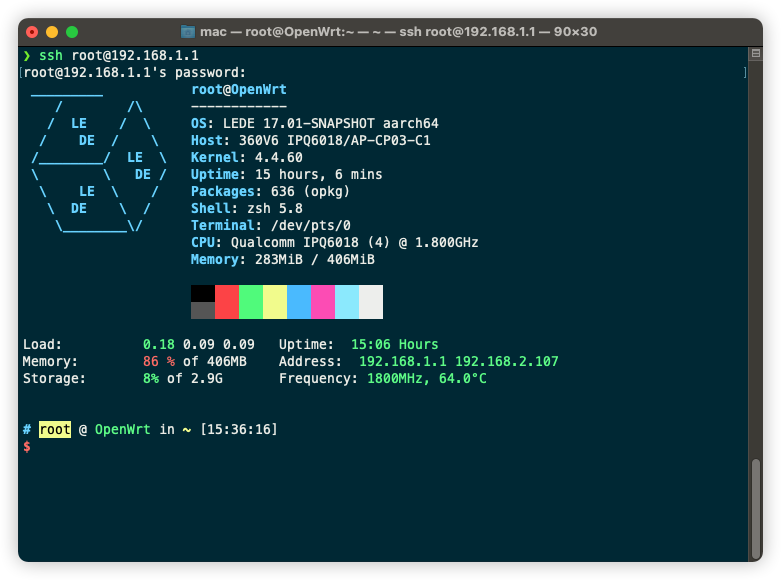

<p align="center">
    <a href="https://github.com/gngpp/openwrt-packages/blob/main/README.md">README</a> | <a href="https://github.com/gngpp/openwrt-packages/blob/main/README-R4S.md">R4S</a> | <a href="https://github.com/gngpp/openwrt-packages/blob/main/README-360v6.md">360v6</a>
</p>

# 360v6
安装脚本使用的是最新版源的插件，自带源安装有坑
- 360V6适用于lean固件 v22.4.7



### 更换源
```conf
src/gz immortalwrt_base https://mirrors.vsean.net/openwrt/releases/21.02-SNAPSHOT/packages/aarch64_cortex-a53/base
src/gz immortalwrt_luci https://mirrors.vsean.net/openwrt/releases/18.06-SNAPSHOT/packages/aarch64_cortex-a53/luci
src/gz immortalwrt_packages https://mirrors.vsean.net/openwrt/releases/21.02-SNAPSHOT/packages/aarch64_cortex-a53/packages
src/gz immortalwrt_routing https://mirrors.vsean.net/openwrt/releases/21.02-SNAPSHOT/packages/aarch64_cortex-a53/routing
src/gz immortalwrt_telephony https://mirrors.vsean.net/openwrt/releases/21.02-SNAPSHOT/packages/aarch64_cortex-a53/telephony

```

### base
> luci-app-uhttpd luci-i18n-uhttpd-zh-cn luci-app-nlbwmon luci-i18n-nlbwmon-zh-cn frpc frps luci-app-frpc luci-app-frps luci-i18n-frpc-zh-cn luci-i18n-frps-zh-cn
```shell
sh -c "$([curl -sSL https://raw.githubusercontent.com/gngpp/openwrt-packages/main/360v6/luci-app/bash.sh](https://raw.githubusercontent.com/gngpp/openwrt-packages/main/360v6/luci-app/base.sh))"
```

### git、git-http
```shell
sh -c "$(curl -sSL https://raw.githubusercontent.com/gngpp/openwrt-packages/main/360v6/git.sh)"
```

### luci-app-diskman
```shell
sh -c "$(curl -sSL https://raw.githubusercontent.com/gngpp/openwrt-packages/main/360v6/luci-app/diskman.sh)"
```

### luci-app-frpc、luci-app-frps
```shell
sh -c "$(curl -sSL https://raw.githubusercontent.com/gngpp/openwrt-packages/main/360v6/luci-app/frpc-frps.sh)"
```

### luci-app-filebrowser
```shell
sh -c "$(curl -sSL https://raw.githubusercontent.com/gngpp/openwrt-packages/main/360v6/luci-app/filebrowser.sh)"
```

### luci-app-alist
```shell
sh -c "$(curl -sSL https://raw.githubusercontent.com/gngpp/openwrt-packages/main/360v6/luci-app/alist.sh)"
```
