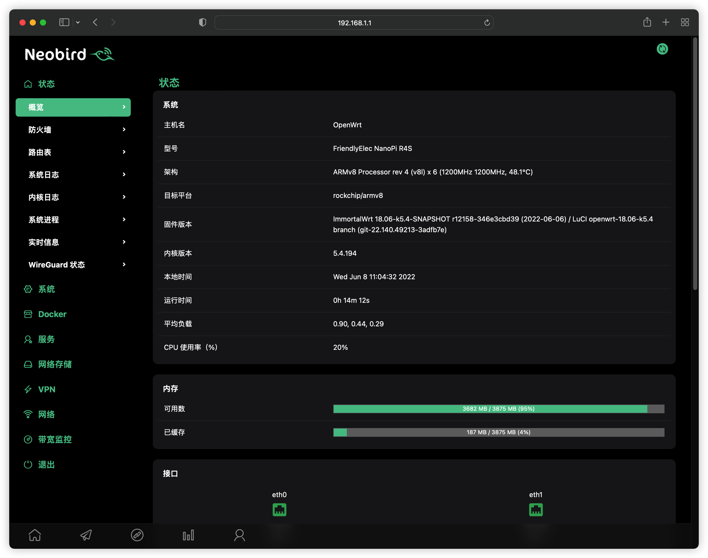

# R4S

- R4S适用于固件项目：https://github.com/SuLingGG/OpenWrt-Rpi

  

### luci-app-alist
```shell
sh -c "$(curl -sSL https://raw.githubusercontent.com/gngpp/openwrt-packages/main/R4S/luci-app/alist.sh)"
```

### luci-app-aliyundrive-fuse
```shell
sh -c "$(curl -sSL https://raw.githubusercontent.com/gngpp/openwrt-packages/main/R4S/luci-app/aliyundrive-fuse.sh)"
```

### luci-app-aliyundrive-webdav
```shell
sh -c "$(curl -sSL https://raw.githubusercontent.com/gngpp/openwrt-packages/main/R4S/luci-app/aliyundrive-webdav.sh)"
```

- install command line

```shell
$ opkg update
$ opkg install luci-app-onliner luci-i18n-onliner-zh-cn
$ opkg install filebrowser luci-app-filebrowser
# 默认安装docker全家桶,20.10.16-1版本docker有bug，每次重启停止iptables规则不会清除，并且每次启动容器，容器ip会变，因为iptables规则没清楚导致规则混乱，iptables nat这边就出问题，lan口设备无法访问映射端口的容器
$ opkg install luci-i18n-dockerman-zh-cn luci-app-dockerman
$ opkg install git git-http usbutils pciutils lsof coreutils-nohup
# GPU
$ opkg install kmod-drm-panfrost
$ opkg install luci-app-aliddns luci-i18n-aliddns-zh-cn luci-app-vlmcsd
$ opkg install luci-app-advancedsetting luci-i18n-advancedsetting-zh-cn
$ opkg install luci-app-accesscontrol luci-i18n-accesscontrol-zh-cn
$ opkg install luci-app-upnp luci-i18n-upnp-zh-cn
$ opkg install luci-app-nlbwmon	luci-i18n-nlbwmon-zh-cn adbyby luci-app-adbyby-plus	luci-i18n-adbyby-plus-zh-cn
```
