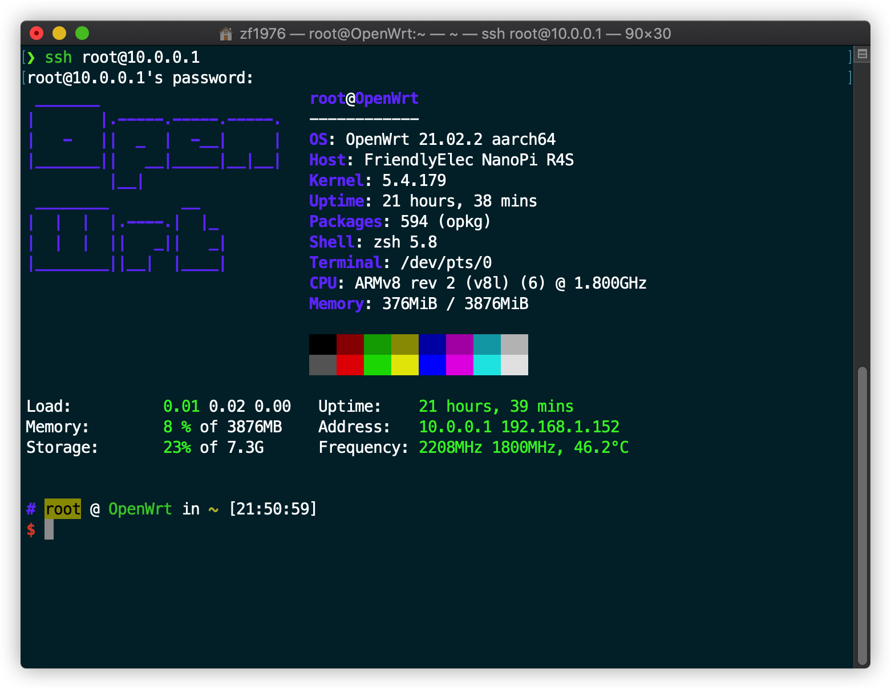

<p align="center">
  <a href="https://github.com/gngpp/packages/blob/main/README.md">README</a> | <a href="https://github.com/gngpp/packages/blob/main/README-R4S.md">R4S</a> | <a href="https://github.com/gngpp/packages/blob/main/README-360v6.md">360v6</a>
</p>

# R4S



> 某些依赖自带库不包含，需要加入下面自定义源再进行安装下载插件，取消签名检测
### 换源
```conf
src/gz immortalwrt_base https://mirrors.vsean.net/openwrt/releases/packages-21.02/aarch64_generic/base

src/gz immortalwrt_luci https://mirrors.vsean.net/openwrt/releases/packages-21.02/aarch64_generic/luci/

src/gz immortalwrt_packages https://mirrors.vsean.net/openwrt/releases/packages-21.02/aarch64_generic/packages

src/gz immortalwrt_routing https://mirrors.vsean.net/openwrt/releases/packages-21.02/aarch64_generic/routing

src/gz immortalwrt_telephony https://mirrors.vsean.net/openwrt/releases/packages-21.02/aarch64_generic/telephony
```

### 常用luci-app
> 含：`ttyd`、 `uhttpd`等
```shell
sh -c "$(curl -sSL https://raw.githubusercontent.com/gngpp/openwrt-packages/main/R4S/luci-app/base.sh)"
```

### luci-app-alist
```shell
sh -c "$(curl -sSL https://raw.githubusercontent.com/gngpp/openwrt-packages/main/R4S/luci-app/alist.sh)"
```

### luci-app-statistics
```shell
sh -c "$(curl -sSL https://raw.githubusercontent.com/gngpp/openwrt-packages/main/R4S/luci-app/statistics.sh)"
```

### luci-app-poweroff
```shell
sh -c "$(curl -sSL https://raw.githubusercontent.com/gngpp/openwrt-packages/main/R4S/luci-app/poweroff.sh)"
```

### luci-app-aliyundrive-fuse
```shell
sh -c "$(curl -sSL https://raw.githubusercontent.com/gngpp/openwrt-packages/main/R4S/luci-app/aliyundrive-fuse.sh)"
```

### luci-app-aliyundrive-webdav
```shell
sh -c "$(curl -sSL https://raw.githubusercontent.com/gngpp/openwrt-packages/main/R4S/luci-app/aliyundrive-webdav.sh)"
```

### luci-app-ftpserver
```shell
sh -c "$(curl -sSL https://raw.githubusercontent.com/gngpp/openwrt-packages/main/R4S/luci-app/ftpserver.sh)"
```

### luci-app-alidns

```shell
sh -c "$(curl -sSL https://raw.githubusercontent.com/gngpp/openwrt-packages/main/R4S/luci-app/alidns.sh)"
```

### luci-app-adguardhome
```shell
sh -c "$(curl -sSL https://raw.githubusercontent.com/gngpp/openwrt-packages/main/R4S/luci-app/adguardhome.sh)"
```

### 使用nginx替换uhttpd
> 默认的uhttpd响应比较慢，建议替换为nginx。
> 先停止uhttp修改端口或者卸载uhttp，否则会端口冲突
```shell
wget https://raw.githubusercontent.com/gngpp/openwrt-packages/main/R4S/nginx.sh && sh nginx.sh && rm nginx.sh
```
> 若需要uhttpd跟nginx同时使用，nginx需要修改默认80 443 端口防止跟uhttpd冲突
> 这时只要安装nginx就可以了，不需要luci-nginx模块
```shell
/etc/init.d/uhttpd stop
opkg update && opkg install nginx
``` 
